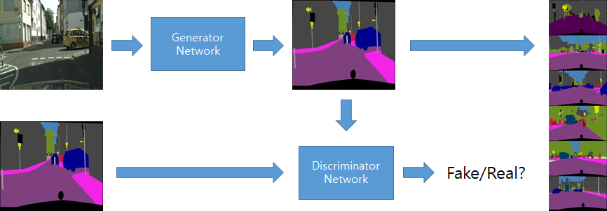

# WGAN: Wasserstein GAN
Assuming that the loss function is a slowly changing value, it is a method to adjust the amount of updating the weight of the neural network using the clipping technique. It is a method in which gradient exploding and mode collapse, known as problems of vanilla GAN, occur less.


<p align="center"></p>

The repository includes:
* Source code of WGAN built on ResNet.
* Training code for stylegan dataset
* Pre-trained weights for stylegan dataset
* Example of training on stylegan dataset(cityscape)

# Testing Environment
* CPU = AMD® Ryzen threadripper 3960x 24-core processor × 48
* GPU = Nvidia Geforce 3090 RTX
* RAM = 128GB
* SSD = 512GB
* OS = Ubuntu 18.04

# Testing Guidelines
The docker file is present in the './assets/docker'.  
You can set a Docker environment by following the steps below.

* Step1: build docker image
```bash
docker build -t wgan -f wgan .
```
* Step2: start a container with the code, images and saved models
```bash
docker run --gpus all -v /home/[username]/workspace:/workspace --rm --shm-size=16g -ti wgan
```
* Step3: check docker container id
```bash
docker ps
```
* Step4: get into docker container
```bash
docker attach [CONTAINER ID]
```
* Step5: Run script for train
```bash
python waegan_pl.py --date "" --dataset "cityscape_data" --batch_size 15 --precision 16
```

# Training
```bash
python waegan_pl.py --date "" --dataset "cityscape_data" --batch_size 15 --precision 16
```
# Testing
```bash
# epoch = [Trained weights to use]-1
python waegan_pl.py --date ""  --dataset "cityscape_data" --validate   --DDP --epoch 499
```
# Resutls
* you can find weight file in './save/[dataset name]_'
* you can find pred image file in './images/_seg_[dataset name]'
* you can find pred image file that overlap the original image in './images/_overlap_[dataset_name]'

# License
GPL-3.0 License
